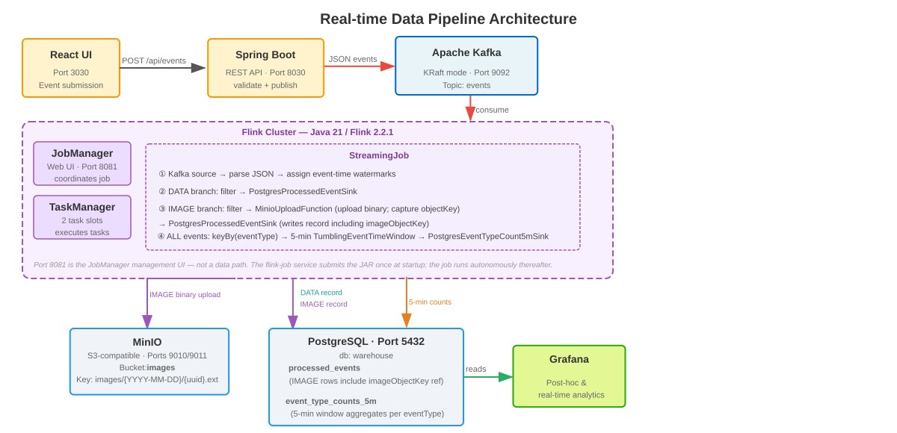

# Real-time Data Pipeline

[](https://github.com/erancha/springboot-kafka-flink-postgres-minio-pipeline/actions/workflows/ci.yml)

**Frontend -> Backend (Spring Boot API) -> Kafka -> Flink -> MinIO/Postgres**

## Summary

The backend → Kafka → Flink → sinks data path treats distributed-systems failure modes as first-class
concerns: idempotent upserts, bounded timeouts on every external I/O path, DLQ routing, SSRF (*)
defense, exactly-once reasoning, and real observability. The depth is backed by 100+ tests,
including Testcontainers integration suites; the CI badge above gates the backend and Flink unit
tests only, while the integration and frontend suites are run separately.

(*) SSRF (Server-Side Request Forgery): blocking attacker-supplied image URLs from reaching
internal hosts — e.g. an `IMAGE` event with `http://169.254.169.254/` to probe cloud metadata.

### Out of scope

This is an exercise focused on the data path's failure handling, not a production deployment. The following are deliberately not built:

- **Authentication / authorization** — the ingestion edge (`POST /api/events` and the React UI) is an unauthenticated local tester, not a hardened production boundary: no login, API key, tenant isolation, or rate limiting, with the SSRF allowlist as the only request-level guard.
- **Secrets management & transport security** — credentials are supplied via a gitignored `.env` (only `.env.example`, with blank values, is committed), but there is no Vault / Secrets Manager integration or rotation, and inter-service traffic on the local Docker network is plaintext (no TLS).
- **DLQ operations** — dead-letter records are captured and metered, but not consumed, replayed, or alerted on. See [DLQ operations](flink/PIPELINE_FLOW.md#dlq-operations).
- **High availability** — single Kafka broker (replication factor 1), single Flink JobManager/TaskManager, and unreplicated Postgres/MinIO; any single loss can mean data loss or downtime. See [Out of scope](flink/PIPELINE_FLOW.md#out-of-scope).
- **Paging / alerting** — Grafana dashboards are for inspection only; no Alertmanager is wired to any signal.

## Overview

This project is a [docker-compose](docker-compose.yml) deployable real-time data pipeline:

- UI (React) sends events to the API
- API (Spring Boot) validates, normalizes, and publishes JSON events to Kafka
- Flink consumes Kafka events and processes them:
  - `IMAGE` events **always** land in MinIO (`images/{date}/{id}.{ext}`), whether the image arrives as an uploaded file (stored by the backend at ingestion) or as a URL (fetched and **cloned** into MinIO by Flink — only the object key is persisted to Postgres, never the source URL). [Why clone the URL instead of referencing it](flink/PIPELINE_FLOW.md#async-image-enrichment): durable, self-contained, ...
  - `DATA` events are stored in Postgres (`processed_events`)

## Architecture



| Service    | Description                                                                                                                                                                                                                                                                                                                                  | URL / Access                                                                           |
| ---------- | -------------------------------------------------------------------------------------------------------------------------------------------------------------------------------------------------------------------------------------------------------------------------------------------------------------------------------------------- | -------------------------------------------------------------------------------------- |
| frontend   | React + Vite, built and served via Nginx                                                                                                                                                                                                                                                                                                     | http://localhost:3030                                                                  |
| backend    | Spring Boot API: [receives](backend/src/main/java/com/webcharm/backend/api/EventController.java) requests, [validates and normalizes](backend/src/main/java/com/webcharm/backend/model/EventRequest.java) input (e.g. `TEXT` → `DATA`), and [publishes](backend/src/main/java/com/webcharm/backend/kafka/EventProducer.java) events to Kafka | http://localhost:8030                                                                  |
| kafka      | Kafka (KRaft mode, i.e. no ZooKeeper) + Kafka UI                                                                                                                                                                                                                                                                                             | http://localhost:8088                                                                  |
| flink      | JobManager / TaskManager + job submitter running the streaming job ([StreamingJob.java](flink/src/main/java/com/webcharm/pipeline/StreamingJob.java), built via [flink/pom.xml](flink/pom.xml))                                                                                                                                              | http://localhost:8081 (commented out by default; to [uncomment](docker-compose.yml))   |
| minio      | Local S3-compatible object storage                                                                                                                                                                                                                                                                                                           | Console: http://localhost:9011 (user `minio`, pass `minio123`)                         |
| postgres   | Analytics database simulating a data warehouse                                                                                                                                                                                                                                                                                               | localhost:5432 (db `warehouse`, user `postgres`, pass `postgres`)                      |
| grafana    | Pre-provisioned dashboards: Postgres analytics, and a Flink pipeline-health dashboard (consumer lag, job restarts, checkpoint health, backpressure, DLQ volume by stage, retryable enrichment failures) backed by the Prometheus datasource                                                                                                  | [http://localhost:3031](http://localhost:3031/dashboards) (user `admin`, pass `admin`) |
| prometheus | Scrapes the Flink JobManager/TaskManager metrics reporter (port 9249) so pipeline operability — consumer lag, restarts, backpressure, checkpoints, the custom `dlq_records` (by stage) and `image_retryable_failures` counters — is queryable                                                                                                | http://localhost:9090                                                                  |

## Architecture Decisions

### Backend

The backend is a narrow, synchronous validation gate: it rejects request bodies over `MAX_REQUEST_CONTENT_LENGTH` as too large (HTTP 413) before parsing, checks request structure and basic constraints (required fields, a non-empty `payload` for `DATA`, allowed `eventType` values), optionally validates `DATA` payloads against a configured JSON Schema (`EVENT_PAYLOAD_SCHEMA`), normalizes `eventType` (e.g. `TEXT` is normalized to `DATA`), and for `IMAGE` URL events enforces an SSRF allowlist (`IMAGE_URL_ALLOWED_HOSTS`) at ingestion — rejecting disallowed hosts as forbidden (HTTP 403) and any other bad input with a 4xx (client error) status before anything reaches Kafka. Heavier validation (fetching the URL, checking content-type/size) is intentionally deferred to Flink to avoid adding latency at the ingestion boundary.

### Pipeline

#### Kafka

- Events are serialized as JSON strings in Kafka. To view events open Kafka UI (see [Architecture](#architecture)).
- A single Kafka topic (`events`) is used to keep the pipeline minimal, since both event types share the same lifecycle (ingest -> process -> sink).
  It would make sense to split topics when:
  - The system requires different retention/compaction policies per event type.
  - The system requires independent scaling/quotas/ACLs per event type (e.g. high-volume `IMAGE` vs low-volume `DATA`).
  - Different teams/consumers own different event streams, which justifies isolation.
- The Kafka partition key is the event `id` (UUID) so all retries/duplicates for the same logical event are consistently routed to the same partition, and ordering is preserved for that key. Across different ids, ordering is intentionally not guaranteed (to allow parallelism).

#### Flink

Everything after Kafka is the Flink job's responsibility; see [`flink/PIPELINE_FLOW.md`](flink/PIPELINE_FLOW.md).

- The Flink job uses routing based on `eventType` and writes to two different sinks (Postgres for `DATA`, MinIO for `IMAGE`).
- MinIO bucket `images` is created by `minio-init` on startup. (To browse stored images: see [Architecture](#architecture).)

## Getting Started

Prereqs:

- Docker Desktop
- Docker Compose v2

WSL:

- Run the scripts from a WSL shell (Bash)

```bash
# If needed, make scripts executable:
chmod +x scripts/*.sh

./scripts/start.sh
```

Then:

- Open UI at http://localhost:3030
- Send `DATA`, `TEXT`, or `IMAGE` events (`TEXT` is normalized to `DATA`)

Additional commands:

```bash
./scripts/start.sh --help               # start options (--restart, --rebuild)
./scripts/stop.sh --help                # stop the stack; --remove-volumes removes volumes, --prune-dangling-images also purges build artifacts
./scripts/test.sh --help                # run tests; see TESTING.md for suite details
./scripts/stress.sh --help              # concurrent DATA/IMAGE-url load generator (requires --profile testing for IMAGE)

./scripts/ps.sh                         # show running containers and service URLs
./scripts/logs.sh --help                # stream logs (supports -e/--errors and per-service filtering)
./scripts/compare-images.sh             # compare image counts in MinIO vs PostgreSQL
```

## Testing

Unit, component, and integration test suites and how to run them are documented in [TESTING.md](TESTING.md).

## Analytics Queries

Post-hoc vs. Flink-pre-aggregated queries, the windowing behavior, and how to run them (CLI and Grafana) are documented in [ANALYTICS.md](ANALYTICS.md).
