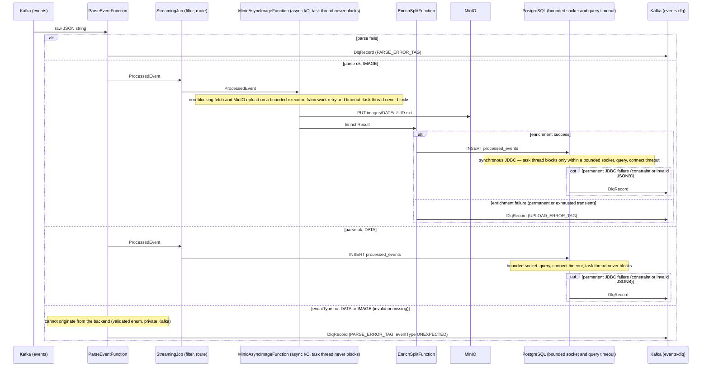

# Flink Pipeline Flow

Everything after Kafka is the Flink job's responsibility: delivery guarantee,
checkpointing, async image enrichment, the bounded JDBC path, retries, and
dead-letter routing. (Backend responsibilities are summarized in the project
[`README.md`](../../README.md).)

**Contents:** [Sequence Diagram](#sequence-diagram) · [In scope](#in-scope) · [Out of scope](#out-of-scope) · [Building blocks](#building-blocks) · [Appendix: Failure handling by stage](#appendix-failure-handling-by-stage)

## Sequence Diagram

A single task thread both processes records and handles the checkpoint barrier — there is no
separate thread for the barrier. So if that thread is blocked waiting
on slow external I/O, it cannot reach the barrier, and the checkpoint can miss its budget (e.g. 60s). Both I/O paths prevent this, by opposite means: the image fetch
and MinIO upload run as Flink async I/O, so the task thread never waits on them at all;
the JDBC write does wait, but only within a strict time bound
(`socketTimeout`/`connectTimeout`/query timeout) kept under the checkpoint budget.
Either way a slow/bad image or a slow/hung DBMS cannot hold up a checkpoint. (Scope: the
event-processing path; the windowed branches are covered in
[`ANALYTICS.md`](ANALYTICS.md).)

## In scope

### Delivery guarantee

The pipeline achieves **effective exactly-once** delivery: Flink triggers a checkpoint on a fixed interval (e.g. 10s), each of which must complete within a timeout (e.g. 60s) or the attempt is aborted; on restart it replays from the last successful checkpoint; idempotent upserts (`ON CONFLICT (id) DO UPDATE` in Postgres, `statObject` existence check in MinIO) absorb any duplicates. Not 2PC.

The upsert keys (`id`, and the `eventTime`-derived MinIO object path) stay identical across a replay because `ParseEventFunction` reads `id` and `eventTime` verbatim from the message; the same input always yields the same keys. A record missing either field routes to the DLQ. This enforces the closed-system invariant — the backend always sets both before publishing to the private Kafka topic — at parse time, so every record reaching the sinks has replay-stable keys that idempotent upserts can dedupe.

### Startup pre-flight

- Before the job graph is submitted, `PreflightChecks` verifies the MinIO bucket exists (which also exercises endpoint reachability and credentials) and that the `processed_events` table exposes every column the writer uses. A misconfigured deployment (bad credentials, missing bucket, missing column) fails immediately with a clear message instead of starting and thrashing the running pipeline.

### Checkpointing & recovery

- Flink consumes the Kafka `events` topic through its `KafkaSource` connector, which tracks each partition's read position in Flink's own checkpoint state rather than in Kafka's consumer group: on restart it seeks each partition to the offset captured by the last successful checkpoint. Kafka auto-commit is disabled (`enable.auto.commit=false`). Flink still writes offsets back to Kafka, but only on a successful checkpoint and only so monitoring tools can compute consumer lag — how many messages sit between the committed offset and the topic's newest record. That committed offset is for visibility alone; recovery uses the checkpoint, never Kafka's committed offset.
- Checkpoints run on a fixed interval (e.g. 10s) with a completion timeout (e.g. 60s), a minimum pause between them (e.g. 5s), and one checkpoint in flight at a time; checkpoints are externalized — retained on disk after cancellation (`RETAIN_ON_CANCELLATION`) so a cancelled job can resume from its last snapshot. The authoritative interval, timeout, and pause live in [`JobEnvironment.configureFaultTolerance`](../../flink/src/main/java/com/webcharm/pipeline/common/config/JobEnvironment.java), shared by both pipelines.
- The restart strategy is exponential back-off (e.g. 5s initial, 2× multiplier, 10-min cap) with indefinite retries; the authoritative values are set alongside the checkpoint config in [`JobEnvironment.java`](../../flink/src/main/java/com/webcharm/pipeline/common/config/JobEnvironment.java).

### Bounded JDBC path

- JDBC connections use a HikariCP pool (pool size 1 per task slot, keepalive e.g. every 60s). The JDBC path is **bounded**: `socketTimeout`/`connectTimeout` on the connection, a per-statement query timeout, a reduced pool borrow timeout, and a bounded retry count, so the worst-case Postgres write stays well under the checkpoint timeout. A sustained outage escalates to Flink checkpoint replay under the exponential-backoff restart strategy (indefinite retries, e.g. 10-min delay cap).
- Transient Postgres write errors (connection reset, deadlock) are retried in-operator with exponential backoff before escalating to checkpoint replay. Permanent Postgres failures (constraint violations, invalid JSONB) are **not** retried — they route to the `events-dlq` Kafka topic, so a bad payload cannot cause an infinite restart loop.

### Batched Postgres writes

- Batching applies only to the high-volume `processed_events` sink (the DATA and IMAGE row writes); the windowed aggregate sinks write per-row, since each window emits only a handful of count rows and has nothing to amortize.
- For the `processed_events` sink, each slot buffers up to `JDBC_BATCH_SIZE` rows (e.g. 500) and commits them as one transaction (`reWriteBatchedInserts` folds them into one multi-row `INSERT`), so one network round-trip and one commit `fsync` amortize across the whole batch instead of being paid per row. It flushes on fill, on `close()`, and on every checkpoint, so committed offsets never lead unflushed rows.
- Failure semantics are unchanged: idempotent `ON CONFLICT` upserts keep replay safe; transient errors retry the whole batch; a permanent error replays the batch row-by-row so good rows commit and only the bad row goes to the DLQ. A bad row caught during a checkpoint flush (no `Collector` then) is held in operator list state and emitted on the next element, so a restart cannot drop it.

### Async image enrichment

- Image fetch + MinIO upload runs as a Flink **async I/O** operator (`AsyncDataStream.unorderedWaitWithRetry`). The HTTP fetch is non-blocking; the blocking MinIO SDK calls run on a bounded executor. The operator task thread is never parked on external I/O, so a slow or unresponsive image URL cannot delay checkpoint barriers. Transient failures (HTTP 5xx, timeouts, I/O errors) are retried by the framework with exponential backoff up to a bounded attempt count (`MINIO_ASYNC_MAX_ATTEMPTS`, e.g. 3); on exhaustion they route to the DLQ. Permanent failures (4xx, redirect/SSRF guard, non-image or absent Content-Type, size cap) route to the DLQ without retry.
- For `imageUrl` events the bytes are **cloned** into MinIO (fetched, then uploaded under our own `images/<date>/<id>` key) and the original URL is dropped — Postgres stores only `image_object_key`, never the source URL. Cloning rather than referencing the source URL is deliberate: it makes pipeline output **durable and self-contained** (a source URL can rot, move, or rate-limit later), gives downstream a **single uniform representation** (both the file-upload and URL sub-paths converge on `image_object_key`, so consumers never branch on URL-vs-object), and yields a **stable byte size** for analytics (a remote URL's content could change underneath us).
- The image-URL SSRF control is enforced both at ingestion (backend host allowlist) and at fetch: the Flink HTTP client uses `followRedirects(NEVER)`, so an allowlisted host cannot redirect the socket to an internal endpoint.

### Dead-letter routing

- Unparsable events, events with an unexpected eventType (not DATA/IMAGE), permanent image enrichment failures, and permanent JDBC write failures are all routed to the `events-dlq` Kafka topic rather than crashing the job or triggering infinite restarts.

- The routing paths (parse, image enrichment, image and data Postgres writes, per-type counts over a window e.g. 5-minute, image-size buckets over a window e.g. 10-minute) are unioned into a single Kafka producer for `events-dlq`. Every `DlqRecord` carries a `stage` field (`DlqStage`: PARSE, IMAGE_ENRICH, IMAGE_POSTGRES, DATA_POSTGRES, EVENT_TYPE_COUNT_POSTGRES, IMAGE_SIZE_BUCKET_COUNT_POSTGRES) identifying its origin, so a consumer can attribute a dead-letter record to its stage without a per-source sink. One sink couples dead-letter backpressure across the branches; dead-letter volume is low by nature (only failures), so this is acceptable.

- This covers **capture**, not operations: records land in `events-dlq` at-least-once and are metered per stage, but consuming, replaying, and alerting on the topic are out of scope — see [DLQ operations](#dlq-operations).

### Observability

Flink and Kafka health is exported as Prometheus metrics (the `metrics-prometheus` reporter on the JobManager and TaskManager), scraped by Prometheus and rendered by Grafana.

What is observed, by purpose:

- **Health (paging-grade):** consumer lag (falling behind ingest), job restarts, checkpoint duration and failures, per-task backpressure, and dead-letter volume per `DlqStage`.
- **Throughput & latency (not paging):** DATA-vs-IMAGE record rates into the Postgres write, and MinIO upload throughput and latency.

The dashboard and its panels are provisioned from [`pipeline-health.json`](../../infra/grafana/provisioning/dashboards/eventtype/pipeline-health.json); the custom counters it reads (`dlq_records`, `image_retryable_failures`, `minio_uploads`/`minio_upload_nanos`) are registered in the Flink job. Those two are the source of truth for the exact metric set and panel layout.

**Alerting:** Grafana-managed rules in [`infra/grafana/provisioning/alerting/`](../../infra/grafana/provisioning/alerting/) email on four Flink-health basics — a scrape target down, no job in RUNNING state, restart-looping, and a Kafka backlog that is not draining — via the SMTP relay in `.env`. Checkpoint-failure, backpressure, and DLQ alerting are out of scope (dashboard-only). [`scripts/alert-test.sh`](../../scripts/alert-test.sh) drives a real outage to verify the target-down rule fires.

## Out of scope

### DLQ operations

The DLQ is **write-only here**. The capture path is complete (at-least-once sink, per-stage `dlq_records` counter, dashboard panel), but the operational side is deliberately not built:

- No consumer reads `events-dlq`; inspecting or draining it is a manual Kafka-UI operation.
- No replay tooling re-injects dead-lettered records once a payload or downstream fix lands.
- No alert fires on a non-zero `dlq_records` rate — DLQ alerting is out of scope, so the dead-letter signal is dashboard-only even though Flink-health rules do page (see [Observability](#observability)).

### Multi-node / HA deployment

The stack runs single-node to fit the resource constraints of a local/demo deployment; horizontal replication and cluster-level failover are not built:

- Kafka: single broker, replication factor 1 — broker loss means data loss.
- Flink: single JobManager (no HA), single TaskManager — no cluster-level failover.
- Postgres and MinIO: no replication or standby.

## Building blocks

A pointer map — open the source for detail. The **job wiring** (sources, windows, sinks, async I/O)
is in `StreamingJob`; the checkpoint/restart config and the DLQ Kafka sink are shared with the
userKeys pipeline via `pipeline.common`; the **cluster** (slots, parallelism, services) is in Docker
Compose.

Tasks aren't declared anywhere — Flink's JobManager derives them at submit time:
**operators** (`StreamingJob`) **× parallelism** (e.g. `-p 8`, set in compose) **→ subtasks → scheduled into slots**
(e.g. 8 on the TaskManager). See the live layout in the Flink UI (e.g. port 8081).

Operator state (the in-flight window counts) uses Flink's default in-memory store — fine at this
volume, so no RocksDB or `config.yaml` tuning is in the repo.

| Building block | Source |
| --- | --- |
| Job wiring, Kafka source, watermarks, windows, async I/O | [`StreamingJob.java`](../../flink/src/main/java/com/webcharm/pipeline/eventtype/StreamingJob.java) |
| Checkpoint/restart config, DLQ sink (shared by both pipelines) | [`JobEnvironment.java`](../../flink/src/main/java/com/webcharm/pipeline/common/config/JobEnvironment.java), [`DlqSink.java`](../../flink/src/main/java/com/webcharm/pipeline/common/dlq/DlqSink.java) |
| Postgres sinks (bounded JDBC) | [`functions/`](../../flink/src/main/java/com/webcharm/pipeline/eventtype/functions/) + [`sinks/`](../../flink/src/main/java/com/webcharm/pipeline/eventtype/sinks/) |
| MinIO async enrichment operator | [`MinioAsyncImageFunction.java`](../../flink/src/main/java/com/webcharm/pipeline/eventtype/functions/MinioAsyncImageFunction.java) |
| Fat JAR build / image | [`flink/pom.xml`](../../flink/pom.xml), [`flink/Dockerfile`](../../flink/Dockerfile) |
| JobManager / TaskManager / slots / parallelism / job submission | [`scripts/docker-compose.yml`](../../scripts/docker-compose.yml) (`flink-*` services) |

## Appendix: Failure handling by stage

Per-stage catalog of handled failures and the job's response — the case-level backing for the reliability behaviors above. The Class column drives the response: **Permanent** routes to the DLQ without retry; **Transient** is retried with bounded backoff before the DLQ (the mechanism — framework async retry, or in-operator retry then checkpoint replay — is given per row); **Misconfig** is caught by pre-flight at startup, before any event is processed.

### Parse stage (`ParseEventFunction`)

| #   | Failure | Class | Response |
| --- | --- | --- | --- |
| 1 | Bad JSON / missing required field / bad timestamp | Permanent | → DLQ (`PARSE_ERROR_TAG`) |
| 2 | eventType not DATA/IMAGE (bad value or missing field) | Unexpected | Cannot originate from the backend (validated enum, private Kafka); folded to the `UNEXPECTED` sentinel, logged, → DLQ (`PARSE_ERROR_TAG`) |

### Image enrichment stage (`MinioAsyncImageFunction` + `EnrichSplitFunction`)

| #   | Failure | Class | Response |
| --- | --- | --- | --- |
| 3 | Bad/blank URL / disallowed scheme / 3xx (redirect/SSRF guard) / 4xx / non-image or absent Content-Type / over size cap (e.g. > 10 MB) | Permanent | `EnrichResult.permanentFailure` → `EnrichSplitFunction` → DLQ; no retry |
| 4 | 5xx / connect or read timeout / I/O error | Transient | `EnrichResult.retryableFailure`; framework async retry (exponential backoff, bounded attempts) → DLQ if exhausted |
| 5 | MinIO auth / missing bucket (startup); disk full (runtime) | Misconfig | Auth/bucket → pre-flight fails the job at startup. Disk full (not pre-checkable) → retryable → DLQ on exhaustion |

### Postgres write stage (`AbstractPostgresWriteFunction` / `JdbcWriterBase`)

| #   | Failure | Class | Response |
| --- | --- | --- | --- |
| 6 | Constraint violation / invalid JSONB | Permanent | Batch fails → row-by-row isolation: good rows commit, the bad row → DLQ (held in list state if hit during a checkpoint flush); no replay loop |
| 7 | Connection timeout / refused / deadlock | Transient | Bounded in-operator retry (e.g. 2 attempts, backoff, reconnect) under socket/query-timeout caps; escalates to checkpoint replay only if exhausted |
| 8 | Auth failure / schema mismatch (missing column) | Misconfig | Non-transient SQLState → `PermanentJdbcException` → DLQ |
