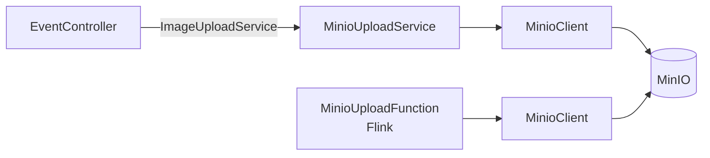
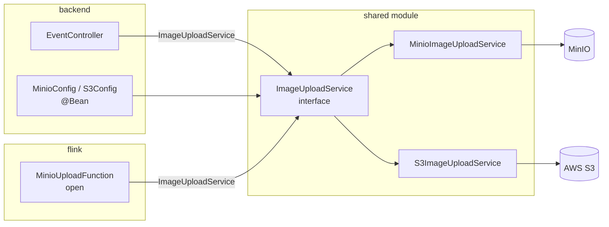

# Future Migration: MinIO → S3

## Current State

The backend has a storage abstraction in place: `ImageUploadService` (interface) and `ObjectStoreException` live in `backend/src/main/java/com/webcharm/backend/storage/` — vendor-neutral. `MinioUploadService` is the sole implementation and lives in the `minio` sub-package.

The Flink job (`MinioUploadFunction`) talks to MinIO directly via `MinioClient`, wired in `open()` from env vars. There is no abstraction layer in Flink yet.



## Target State

A shared Maven module will hold the abstraction and both implementations. Each consuming module will wire up the implementation it needs — Spring Boot via `@Bean`, Flink via direct instantiation in `open()`.



## Migration Steps

### 1. Create the shared module

Add a `shared/` Maven module with no Spring, no Flink dependencies — only the vendor SDKs needed by each implementation.

```
shared/
  pom.xml                          ← depends on minio SDK + AWS SDK
  src/main/java/com/webcharm/shared/storage/
    ImageUploadService.java        ← move from backend/storage (unchanged)
    ObjectStoreException.java      ← move from backend/storage (unchanged)
    MinioImageUploadService.java   ← move + rename from backend/minio/MinioUploadService
    S3ImageUploadService.java      ← new
```

Add the `shared` module as a dependency in both `backend/pom.xml` and `flink/pom.xml`.

### 2. Write S3ImageUploadService

Implement `ImageUploadService` using the AWS S3 SDK. Mirror the key structure (`images/{date}/{uuid}.{ext}`) so stored objects are path-compatible with MinIO.

### 3. Wire the implementation

**Backend** — swap the `@Bean` in `MinioConfig` (or add `S3Config`):
```java
@Bean
ImageUploadService imageUploadService(...) {
    return new S3ImageUploadService(s3Client, bucket);
}
```

**Flink** — swap the instantiation in `MinioUploadFunction.open()`:
```java
this.imageUploadService = new S3ImageUploadService(s3Client, bucket);
```

### 4. Configuration

Replace the `MINIO_*` env vars with `AWS_REGION`, `AWS_ACCESS_KEY_ID`, `AWS_SECRET_ACCESS_KEY`, `S3_BUCKET`. Both sets can coexist during transition.

### 5. Data migration

Existing objects in MinIO need to be copied to S3 before cutover. The key structure is identical, so no application-level changes are needed for previously stored references.

## Why Not Now

The interface (`ImageUploadService`) is already the preparation. Extracting the shared module before a second implementation exists is premature — it adds Maven multi-module complexity with no immediate benefit. Extract when S3 support is actually needed; it will be a mechanical refactor.
