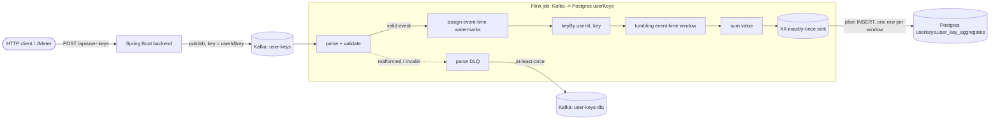

# userKeys pipeline flow

The userKeys pipeline ingests `{userId, key, value, …}` events and maintains, per tumbling time
window, the sum of `value` for each `(userId, key)` pair in PostgreSQL. Delivery into Postgres is
exactly-once through Flink's own two-phase commit over XA, so each window result is written once
without relying on idempotent upserts.

## Data flow



## Ingestion (backend)

`POST /api/user-keys` accepts `{userId, key, value}`. Bean Validation requires `userId` and `key`
non-blank and `value` present and numeric; a violation returns 400 before anything reaches Kafka.
The backend stamps a UUIDv7 `id` and an `eventTime`, then publishes the event JSON to the `user-keys`
topic under the partition key `userId|key`. That key co-locates one aggregation key's events on a
single partition for per-key ordering and locality; aggregation correctness does not depend on it,
since the job re-keys downstream.

## Stream processing (Flink)

The job consumes `user-keys` under the consumer group `flink-userkeys-processor`, with Kafka
auto-commit disabled so offsets advance only when a Flink checkpoint succeeds. Processing stages:

1. **Parse and validate** — deserialize the JSON into a typed event. Records that cannot be stored or
   aggregated are diverted here (see Error surface); everything downstream is known-good.
2. **Event-time watermarks** — a bounded-out-of-orderness watermark is assigned from each event's
   `eventTime`. The watermark advances only as later events arrive, so a window closes while events
   keep flowing; once the stream goes fully silent the watermark freezes and the trailing window
   fires only when ingestion resumes.
3. **Key and window** — events are keyed by `(userId, key)` and grouped into tumbling event-time
   windows of `USERKEYS_WINDOW_SECONDS` (default 60). Allowed lateness is zero, so each window fires
   exactly once and emits a single result.
4. **Sum** — an incremental aggregate keeps one running `long` per active `(userId, key)`, so window
   state grows with the number of distinct active keys, not with event volume or window length.
5. **Sink** — each window result is written to `user_key_aggregates` as a plain `INSERT`.

## Exactly-once delivery into Postgres

The sink uses the JDBC connector's XA exactly-once sink. At each checkpoint it prepares an XA
transaction holding that checkpoint's writes; when the checkpoint completes, Flink commits the
prepared transaction. A failure before the checkpoint completes rolls the prepared transaction back
and the job restarts from the last checkpoint, so no window result is committed twice and none is
lost. Because delivery is exactly-once, the table uses a plain `INSERT` with primary key
`(window_start, user_id, key)` — no upsert and no application-level deduplication.

Two settings make this correct:

- **`maxRetries = 0`** — an in-sink retry would re-execute statements outside the commit protocol and
  could duplicate rows, so retries are left to Flink's checkpoint-restart instead.
- **`transactionPerConnection = true`** — PostgreSQL holds at most one XA transaction per connection.

XA depends on PostgreSQL prepared transactions, which the server enables via
`max_prepared_transactions` (0, the default, disables them). The stack sizes this from the job
parallelism: the peak number of simultaneously-prepared transactions is `parallelism ×
(maxConcurrentCheckpoints + 1)`, and the provisioned value carries a margin above that. If it is ever
too low, the sink reports `maximum number of prepared transactions reached` and the job restart-loops
until the limit is raised.

Bounded socket and connect timeouts on the datasource keep a hung Postgres socket from stalling a
checkpoint past its timeout.

## Storage

Database `userkeys`, table `user_key_aggregates`:

| column         | type        | meaning                                  |
| -------------- | ----------- | ---------------------------------------- |
| `window_start` | timestamptz | inclusive start of the tumbling window   |
| `window_end`   | timestamptz | exclusive end of the tumbling window     |
| `user_id`      | text        | event `userId`                           |
| `key`          | text        | event `key`                              |
| `value_sum`    | bigint      | sum of `value` for the pair in the window |

The primary key is `(window_start, user_id, key)`. `window_start` leads the key so inserts append in
event-time order at the index's right edge.

## Error surface

The Flink parse stage re-validates every record — **defense-in-depth, not the expected route.** Since
the backend already rejects malformed input at ingestion and `user-keys` is private to it, a record
reaching this guard means a non-backend writer or a schema skew, not normal traffic — in steady state
this DLQ stays empty. It diverts unparseable JSON, a missing or wrong-typed `id`/`eventTime`/`userId`/`key`,
a non-numeric `value`, or a NUL byte in `userId`/`key` (the one input the backend's `@NotBlank` permits
but a Postgres text column rejects) to the `user-keys-dlq` topic, with the raw event plus reason,
counted as a Prometheus metric. Diverting upstream of the sink keeps its input strictly writable, so a
poison row can never stall the windowed-aggregate commit. The dead-letter sink is at-least-once flushed
per checkpoint: a duplicate dead-letter is acceptable, silent loss is not.

Every other fault — a transient database or network error, or a crash between prepare and commit — is
absorbed by the checkpoint-restart cycle described under [Exactly-once delivery](#exactly-once-delivery-into-postgres);
nothing here is application-specific.

## Observability

Flink exposes job, checkpoint, restart, and dead-letter metrics to Prometheus; Kafka consumer lag for
`flink-userkeys-processor` comes from the Kafka exporter. The `userKeys Pipeline Health` Grafana
dashboard renders job liveness, checkpoint duration and size, restarts, consumer lag, and dead-letter
rate. A "Kafka consumer stalled (userKeys)" alert fires when the consumer group holds a backlog that
is not draining. The `userKeys Stored Aggregates Analytics` dashboard reads the `user_key_aggregates`
table directly for the windowed sums.

## Running it

One pipeline runs at a time, selected by Compose profile:

```bash
./scripts/start.sh --pipeline userkeys           # start the stack (add --restart to switch from another pipeline)
./scripts/userkeys/send-event.sh                 # send a burst and verify the windowed sum
./scripts/jmeter-helper.sh --pipeline userkeys   # load-test ingestion
```

`send-event.sh` sends a burst for one `(userId, key)` and then emits heartbeat events on a throwaway
key to advance the watermark until the window closes, so it can read back and verify the summed
result — a single event alone never closes its own window.
