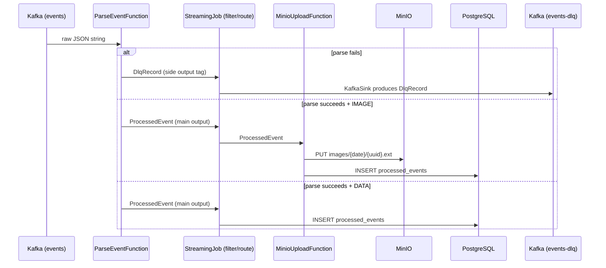

# Flink Pipeline Flow

## Failure Handling — Current Status

Inventory of every failure mode in the pipeline today, the gap vs. a sustainable design, and the target behavior. Each failure is classified into one of three classes:

| Class                  | Mechanism                                                      |
| ---------------------- | -------------------------------------------------------------- |
| Permanent (bad data)   | DLQ — replay can't fix the payload                             |
| Transient (infra blip) | In-operator retry with bounded backoff → re-throw if exhausted |
| Infra misconfig        | `log.error(...)` + re-throw immediately                        |

### Parse stage (`ParseEventFunction`)

| #   | Failure                                           | Class     | Current behavior | Gap              | New behavior                                           |
| --- | ------------------------------------------------- | --------- | ---------------- | ---------------- | ------------------------------------------------------ |
| 1   | Bad JSON / missing required field / bad timestamp | Permanent | DLQ              | -                | -                                                      |
| 2   | Unknown `eventType` (not DATA/IMAGE)              | Permanent | Silently dropped | No observability | Drop + emit counter metric `flink.events.unknown_type` |

### MinIO upload stage (`MinioUploadFunction`)

| #   | Failure                                                                        | Class           | Current behavior                                                                  | Gap                                         | New behavior                            |
| --- | ------------------------------------------------------------------------------ | --------------- | --------------------------------------------------------------------------------- | ------------------------------------------- | --------------------------------------- |
| 3   | Bad base64 / bad URL / disallowed scheme or host / HTTP 4xx / response > 10 MB | Permanent       | DLQ                                                                               | -                                           | -                                       |
| 4   | HTTP 5xx, HTTP timeout (connect > 10 s or read > 30 s)                         | Transient       | In-operator retry (3 attempts, exponential backoff: 1 s / 2 s) → DLQ if exhausted | -                                           | -                                       |
| 5   | MinIO auth / bucket missing / disk full                                        | Infra misconfig | DLQ                                                                               | Silent data routing instead of loud failure | `log.error(...)` + re-throw immediately |

### Postgres write stage (`PostgresProcessedEventWriter` / `PostgresEventTypeCount5mWriter`)

JDBC connections are managed by HikariCP (pool size 1 per task slot, keepalive every 60 s), which
validates and replaces stale connections before they reach the writer.

| #   | Failure                                         | Class           | Current behavior                                                                                                                                 | Gap                                                         | Target                                                                                   |
| --- | ----------------------------------------------- | --------------- | ------------------------------------------------------------------------------------------------------------------------------------------------ | ----------------------------------------------------------- | ---------------------------------------------------------------------------------------- |
| 6   | Constraint violation / invalid JSONB            | Permanent       | Re-throws IOException → Flink checkpoint replay → infinite loop                                                                                  | Replay cannot fix a bad payload; needs DLQ routing          | Route to DLQ instead of re-throwing                                                      |
| 7   | Connection timeout / refused / deadlock         | Transient       | In-operator retry: 3 attempts with 1s / 2s backoff and reconnect; re-throws IOException → Flink checkpoint replay only if all attempts exhausted | -                                                           | -                                                                                        |
| 8   | Auth failure / schema mismatch (missing column) | Infra misconfig | Re-throws IOException → Flink checkpoint replay → restart cycle                                                                                  | Restart cycle cannot fix a config error; needs loud failure | `log.error(...)` + re-throw immediately (same effect today, but replay loop is wasteful) |

### Cross-cutting

| #   | Failure                                         | Class     | Current behavior        | Gap | New behavior |
| --- | ----------------------------------------------- | --------- | ----------------------- | --- | ------------ |
| 9   | DLQ Kafka sink fails / checkpoint storage fails | Infra     | Job dies                | -   | -            |
| 10  | TaskManager crash                               | Transient | Restart from checkpoint | -   | -            |

## Sequence Diagram

