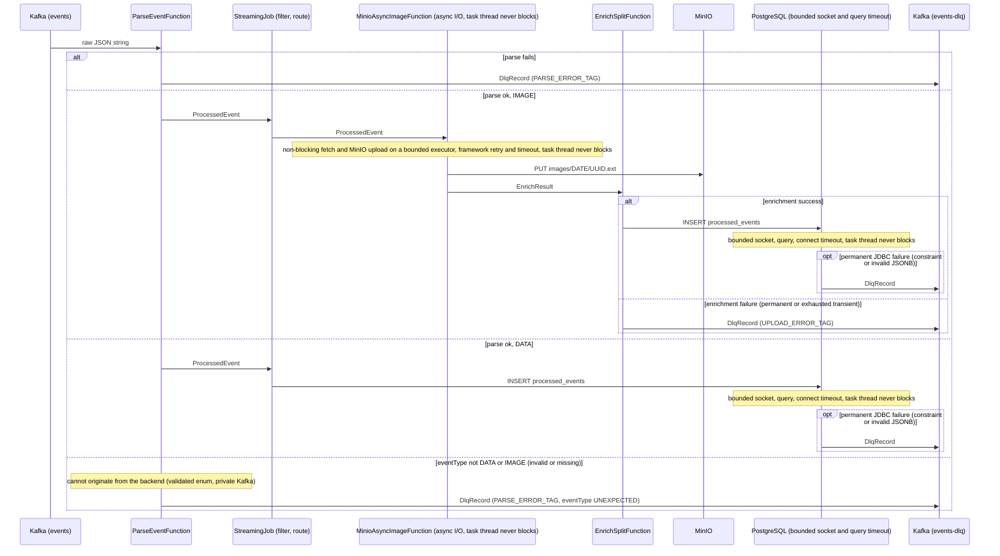

# Flink Pipeline Flow

Everything after Kafka is the Flink job's responsibility: delivery guarantee,
checkpointing, async image enrichment, the bounded JDBC path, retries, and
dead-letter routing. (Backend responsibilities are summarized in the project
[`README.md`](../README.md).)

## In scope

### Delivery guarantee

The pipeline achieves **effective exactly-once** delivery: Flink triggers a checkpoint every 10s (each must complete within the 60s timeout, else that attempt is aborted); on restart it replays from the last successful checkpoint; idempotent upserts (`ON CONFLICT (id) DO UPDATE` in Postgres, `statObject` existence check in MinIO) absorb any duplicates. Not 2PC.

### Checkpointing & recovery

- Kafka consumer offsets are committed only on successful checkpoint (`enable.auto.commit=false`), so the committed offset always reflects durably processed state.
- Flink checkpoints: 10s interval, 60s timeout, 5s minimum pause between checkpoints, one in-flight at a time. Externalized checkpoints (`RETAIN_ON_CANCELLATION`) are kept on disk after cancellation.
- Restart strategy: exponential back-off (5s initial, 2× multiplier, 10 min cap), indefinite retries.

### Async image enrichment

- Image fetch + MinIO upload runs as a Flink **async I/O** operator (`AsyncDataStream.unorderedWaitWithRetry`). The HTTP fetch is non-blocking; the blocking MinIO SDK calls run on a bounded executor. The operator task thread is never parked on external I/O, so a slow or unresponsive image URL cannot delay checkpoint barriers. Transient failures (HTTP 5xx, timeouts, I/O errors) are retried by the framework with exponential backoff up to a bounded attempt count (`MINIO_ASYNC_MAX_ATTEMPTS`, default 3); on exhaustion they route to the DLQ. Permanent failures (4xx, redirect/SSRF guard, size cap) route to the DLQ without retry.
- The image-URL SSRF control is enforced both at ingestion (backend host allowlist) and at fetch: the Flink HTTP client uses `followRedirects(NEVER)`, so an allowlisted host cannot redirect the socket to an internal endpoint.

### Bounded JDBC path

- JDBC connections use a HikariCP pool (pool size 1 per task slot, keepalive every 60s). The JDBC path is **bounded**: `socketTimeout`/`connectTimeout` on the connection, a per-statement query timeout, a reduced pool borrow timeout, and a bounded retry count, so the worst-case Postgres write stays well under the checkpoint timeout. A sustained outage escalates to Flink checkpoint replay under the exponential-backoff restart strategy (indefinite retries, 10-min delay cap).
- Transient Postgres write errors (connection reset, deadlock) are retried in-operator with exponential backoff before escalating to checkpoint replay. Permanent Postgres failures (constraint violations, invalid JSONB) are **not** retried — they route to the `events-dlq` Kafka topic, so a bad payload cannot cause an infinite restart loop.

### Startup pre-flight

- Before the job graph is submitted, `PreflightChecks` verifies the MinIO bucket exists (which also exercises endpoint reachability and credentials) and that the `processed_events` table exposes every column the writer uses. A misconfigured deployment (bad credentials, missing bucket, missing column) fails immediately with a clear message instead of starting and thrashing the running pipeline.

### Dead-letter routing

- Unparsable events, events with an unexpected eventType (not DATA/IMAGE), permanent image enrichment failures, and permanent JDBC write failures are all routed to the `events-dlq` Kafka topic rather than crashing the job or triggering infinite restarts.

- The four routing paths (parse, image enrichment, Postgres write, 5-minute counts) are unioned into a single Kafka producer for `events-dlq`. Every `DlqRecord` carries a `stage` field (`DlqStage`: PARSE, IMAGE_ENRICH, IMAGE_POSTGRES, DATA_POSTGRES, COUNT_POSTGRES) identifying its origin, so a consumer can attribute a dead-letter record to its stage without a per-source sink. One sink couples dead-letter backpressure across the branches; dead-letter volume is low by nature (only failures), so this is acceptable.

### Parse stage (`ParseEventFunction`)

| #   | Failure                                                   | Class      | Current behavior                                                                                                                                                                                                                                                   |     |
| --- | --------------------------------------------------------- | ---------- | ------------------------------------------------------------------------------------------------------------------------------------------------------------------------------------------------------------------------------------------------------------------ | --- |
| 1   | Bad JSON / missing required field / bad timestamp         | Permanent  | Routed to DLQ via `PARSE_ERROR_TAG`                                                                                                                                                                                                                                |     |
| 2   | eventType not DATA/IMAGE (invalid value or missing field) | Unexpected | Cannot originate from the backend (eventType is a validated enum, normalized to DATA/IMAGE before Kafka; Kafka is private). `ParseEventFunction` folds any such value to the `UNEXPECTED` sentinel, logs an error, and routes it to the DLQ via `PARSE_ERROR_TAG`. |     |

### Image enrichment stage (`MinioAsyncImageFunction` + `EnrichSplitFunction`)

| #   | Failure                                                                                          | Class     | Current behavior                                                                                                                                                                                                   |     |
| --- | ------------------------------------------------------------------------------------------------ | --------- | ------------------------------------------------------------------------------------------------------------------------------------------------------------------------------------------------------------------ | --- |
| 3   | Bad/blank URL / disallowed scheme / HTTP 3xx (redirect/SSRF guard) / HTTP 4xx / response > 10 MB | Permanent | `EnrichResult.permanentFailure` → `EnrichSplitFunction` → DLQ; never retried                                                                                                                                       |     |
| 4   | HTTP 5xx / connect or read timeout / I/O error                                                   | Transient | `EnrichResult.retryableFailure`; framework `AsyncRetryStrategy` retries with exponential backoff up to a bounded attempt count; routed to DLQ if exhausted                                                         |     |
| 5   | MinIO auth / bucket missing (startup); disk full (runtime)                                       | Misconfig | Auth or missing bucket: `PreflightChecks` fails the job at startup before any event is processed. Disk full (a runtime condition, not pre-checkable): treated as a retryable failure → retried → DLQ on exhaustion |     |

### Postgres write stage (`AbstractPostgresWriteFunction` / `JdbcWriterBase`)

| #   | Failure                                         | Class     | Current behavior                                                                                                                                                                                                                                                     |     |
| --- | ----------------------------------------------- | --------- | -------------------------------------------------------------------------------------------------------------------------------------------------------------------------------------------------------------------------------------------------------------------- | --- |
| 6   | Constraint violation / invalid JSONB            | Permanent | `PermanentJdbcException` → `AbstractPostgresWriteFunction` emits a `DlqRecord`; no replay loop                                                                                                                                                                       |     |
| 7   | Connection timeout / refused / deadlock         | Transient | Bounded in-operator retry (default 2 attempts, exponential backoff, reconnect) with `socketTimeout`/query-timeout caps; escalates to Flink checkpoint replay under the exponential-backoff restart strategy (indefinite retries, 10-min delay cap) only if exhausted |     |
| 8   | Auth failure / schema mismatch (missing column) | Misconfig | Non-transient SQLState → `PermanentJdbcException` → DLQ with `log.error`                                                                                                                                                                                             |     |

## Sequence Diagram

The async image operator and the bounded JDBC write keep external I/O off the
operator task thread: the task thread never blocks on a fetch, upload, or query,
and every external call is time-bounded under the checkpoint budget, so a
slow/bad image or a slow/hung DBMS cannot stall checkpoint barriers. (Scope: the
event-processing path; the 5-minute windowed-count branch is covered in
[`../ANALYTICS.md`](../ANALYTICS.md).)

## Out of scope (single-node deployment)

- Kafka: single broker, replication factor 1 — broker loss means data loss.
- Flink: single JobManager (no HA), single TaskManager — no automatic failover at the cluster level.
- Postgres and MinIO: no replication or standby.
