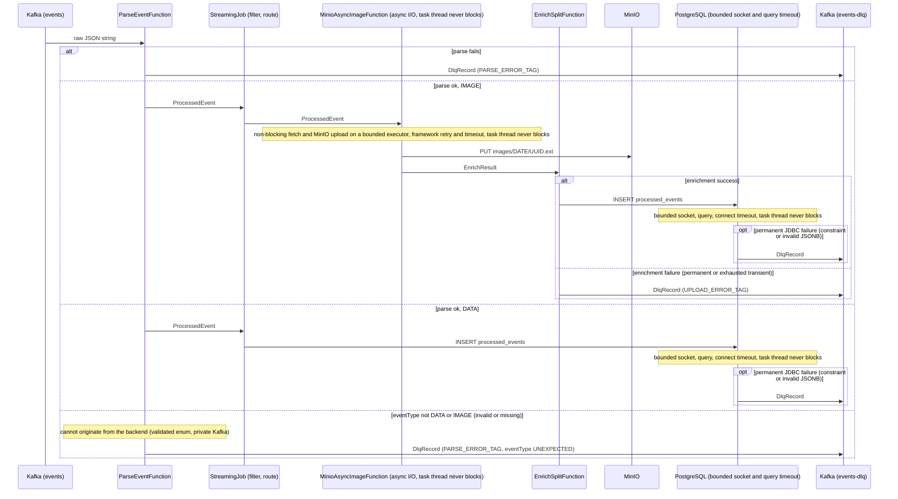

# Flink Pipeline Flow

Everything after Kafka is the Flink job's responsibility: delivery guarantee,
checkpointing, async image enrichment, the bounded JDBC path, retries, and
dead-letter routing. (Backend responsibilities are summarized in the project
[`README.md`](../README.md).)

## In scope

### Delivery guarantee

The pipeline achieves **effective exactly-once** delivery: Flink triggers a checkpoint every 10s (each must complete within the 60s timeout, else that attempt is aborted); on restart it replays from the last successful checkpoint; idempotent upserts (`ON CONFLICT (id) DO UPDATE` in Postgres, `statObject` existence check in MinIO) absorb any duplicates. Not 2PC.

The upsert keys (`id`, and the `eventTime`-derived MinIO object path) are stable across a replay because parsing is deterministic: `ParseEventFunction` reads `id` and `eventTime` verbatim from the message and routes a record missing either to the DLQ instead of backfilling a generated UUID or wall-clock time. A fabricated key would change on replay and write a duplicate, so the closed-system invariant (the backend always sets both before publishing to the private Kafka topic) is enforced at parse rather than assumed.

### Checkpointing & recovery

- Kafka consumer offsets are committed only on successful checkpoint (`enable.auto.commit=false`), so the committed offset always reflects durably processed state.
- Flink checkpoints: 10s interval, 60s timeout, 5s minimum pause between checkpoints, one in-flight at a time. Externalized checkpoints (`RETAIN_ON_CANCELLATION`) are kept on disk after cancellation.
- Restart strategy: exponential back-off (5s initial, 2× multiplier, 10 min cap), indefinite retries.

### Async image enrichment

- Image fetch + MinIO upload runs as a Flink **async I/O** operator (`AsyncDataStream.unorderedWaitWithRetry`). The HTTP fetch is non-blocking; the blocking MinIO SDK calls run on a bounded executor. The operator task thread is never parked on external I/O, so a slow or unresponsive image URL cannot delay checkpoint barriers. Transient failures (HTTP 5xx, timeouts, I/O errors) are retried by the framework with exponential backoff up to a bounded attempt count (`MINIO_ASYNC_MAX_ATTEMPTS`, default 3); on exhaustion they route to the DLQ. Permanent failures (4xx, redirect/SSRF guard, non-image or absent Content-Type, size cap) route to the DLQ without retry.
- For `imageUrl` events the bytes are **cloned** into MinIO (fetched, then uploaded under our own `images/<date>/<id>` key) and the original URL is dropped — Postgres stores only `image_object_key`, never the source URL. Cloning rather than referencing the source URL is deliberate: it makes pipeline output **durable and self-contained** (a source URL can rot, move, or rate-limit later), gives downstream a **single uniform representation** (both the file-upload and URL sub-paths converge on `image_object_key`, so consumers never branch on URL-vs-object), and yields a **stable byte size** for analytics (a remote URL's content could change underneath us).
- The image-URL SSRF control is enforced both at ingestion (backend host allowlist) and at fetch: the Flink HTTP client uses `followRedirects(NEVER)`, so an allowlisted host cannot redirect the socket to an internal endpoint.

### Bounded JDBC path

- JDBC connections use a HikariCP pool (pool size 1 per task slot, keepalive every 60s). The JDBC path is **bounded**: `socketTimeout`/`connectTimeout` on the connection, a per-statement query timeout, a reduced pool borrow timeout, and a bounded retry count, so the worst-case Postgres write stays well under the checkpoint timeout. A sustained outage escalates to Flink checkpoint replay under the exponential-backoff restart strategy (indefinite retries, 10-min delay cap).
- Transient Postgres write errors (connection reset, deadlock) are retried in-operator with exponential backoff before escalating to checkpoint replay. Permanent Postgres failures (constraint violations, invalid JSONB) are **not** retried — they route to the `events-dlq` Kafka topic, so a bad payload cannot cause an infinite restart loop.

### Startup pre-flight

- Before the job graph is submitted, `PreflightChecks` verifies the MinIO bucket exists (which also exercises endpoint reachability and credentials) and that the `processed_events` table exposes every column the writer uses. A misconfigured deployment (bad credentials, missing bucket, missing column) fails immediately with a clear message instead of starting and thrashing the running pipeline.

### Dead-letter routing

- Unparsable events, events with an unexpected eventType (not DATA/IMAGE), permanent image enrichment failures, and permanent JDBC write failures are all routed to the `events-dlq` Kafka topic rather than crashing the job or triggering infinite restarts.

- The routing paths (parse, image enrichment, image and data Postgres writes, 5-minute per-type counts, 10-minute image-size buckets) are unioned into a single Kafka producer for `events-dlq`. Every `DlqRecord` carries a `stage` field (`DlqStage`: PARSE, IMAGE_ENRICH, IMAGE_POSTGRES, DATA_POSTGRES, EVENT_TYPE_COUNT_POSTGRES, IMAGE_SIZE_BUCKET_COUNT_POSTGRES) identifying its origin, so a consumer can attribute a dead-letter record to its stage without a per-source sink. One sink couples dead-letter backpressure across the branches; dead-letter volume is low by nature (only failures), so this is acceptable.

### Observability

Pipeline health is exported as Prometheus metrics, not just logs. The Flink Prometheus reporter (the `metrics-prometheus` plugin bundled in the `apache/flink:2.2` image) runs on the JobManager and TaskManager at port 9249; a Prometheus container scrapes both, and Grafana renders the pre-provisioned [**Pipeline Health** dashboard](http://localhost:3031/d/pipeline-health) through a Prometheus datasource, provisioned from [`infra/grafana/provisioning/dashboards/pipeline-health.json`](../infra/grafana/provisioning/dashboards/pipeline-health.json). It is a Flink-reporter-backed dashboard; the only Kafka signal is the Flink source's consumer lag, not broker-level metrics. The dashboard is split into two rows: **Health** (paging-grade signals — is the pipeline OK at 3am) and **Throughput & performance** (workload shape and latency, deliberately not paging signals).

Health row:

- Reporter-native (no code): Kafka-source consumer lag (`pendingRecords`), job restarts, last-checkpoint duration and failed-checkpoint count, and per-task backpressure / busy time. The paging-grade copy of consumer lag is owned by this row because sustained lag growth is the canonical "falling behind ingest" alarm; a read-only mirror of the same series is repeated in the Throughput row for cross-referencing.
- Custom counters: `dlq_records`, labelled by the same `DlqStage` carried on every `DlqRecord`, so the `IMAGE_ENRICH` series is the enrichment failure rate. A pass-through `DlqMeterFunction` registers it immediately before the `events-dlq` sink and emits each record unchanged, so metering does not alter dead-letter behavior. `image_retryable_failures` is incremented when `MinioAsyncImageFunction` classifies a transient failure, giving retry pressure on the IMAGE branch.

Throughput & performance row:

- Reporter-native (no code): per-second and cumulative `numRecordsIn` on the `data_to_postgres` and `image_to_postgres` operators, giving the DATA-vs-IMAGE workload split as it enters the Postgres write. Permanent write failures still count here; the per-stage DLQ panel in the Health row carries the failure split. The left column stacks the consumer-lag mirror, events/sec, and the cumulative-by-type counter top-to-bottom (the latter two are the same `numRecordsIn` series as a rate and as a raw counter), so lag, throughput, and total volume for a path read down one column — rising lag while events/sec is flat means the pipeline, not the inbound rate, is the bottleneck.
- Custom counters on the `minio-enrich-async` operator: `minio_uploads` (successful `putObject` calls) and `minio_upload_nanos` (cumulative upload duration). Average upload latency is derived in Prometheus as `rate(minio_upload_nanos) / rate(minio_uploads)`, and uploads/sec as `rate(minio_uploads)`. Only successful uploads are metered — idempotency hits and backend-uploaded passthrough images perform no `putObject` and are excluded, so the metrics reflect genuine writes.

Deliberate boundaries: the backend is not Micrometer-instrumented (only Kafka/Flink are exported); per-attempt retry counts are not metered because `JdbcWriterBase` has no Flink metric group, and a retries-exhausted outcome is already visible as `dlq_records` volume for its stage. There is no Alertmanager — the dashboard is for inspection, not paging.

## Failure handling by stage

The tables below catalog, per stage, every handled failure mode and the job's concrete response — the case-level backing for the reliability behaviors described above. The Class column drives the response: Permanent routes to the DLQ without retry, Transient is retried with bounded backoff before the DLQ (the exact mechanism — framework async retry or in-operator retry then checkpoint replay — differs per stage and is given in the row), and startup misconfiguration is caught by pre-flight before any event is processed.

### Parse stage (`ParseEventFunction`)

| #   | Failure                                                   | Class      | Current behavior                                                                                                                                                                                                                                                   |     |
| --- | --------------------------------------------------------- | ---------- | ------------------------------------------------------------------------------------------------------------------------------------------------------------------------------------------------------------------------------------------------------------------ | --- |
| 1   | Bad JSON / missing required field / bad timestamp         | Permanent  | Routed to DLQ via `PARSE_ERROR_TAG`                                                                                                                                                                                                                                |     |
| 2   | eventType not DATA/IMAGE (invalid value or missing field) | Unexpected | Cannot originate from the backend (eventType is a validated enum, normalized to DATA/IMAGE before Kafka; Kafka is private). `ParseEventFunction` folds any such value to the `UNEXPECTED` sentinel, logs an error, and routes it to the DLQ via `PARSE_ERROR_TAG`. |     |

### Image enrichment stage (`MinioAsyncImageFunction` + `EnrichSplitFunction`)

| #   | Failure                                                                                          | Class     | Current behavior                                                                                                                                                                                                   |     |
| --- | ------------------------------------------------------------------------------------------------ | --------- | ------------------------------------------------------------------------------------------------------------------------------------------------------------------------------------------------------------------ | --- |
| 3   | Bad/blank URL / disallowed scheme / HTTP 3xx (redirect/SSRF guard) / HTTP 4xx / non-image or absent Content-Type / response > 10 MB | Permanent | `EnrichResult.permanentFailure` → `EnrichSplitFunction` → DLQ; never retried                                                                                                                                       |     |
| 4   | HTTP 5xx / connect or read timeout / I/O error                                                   | Transient | `EnrichResult.retryableFailure`; framework `AsyncRetryStrategy` retries with exponential backoff up to a bounded attempt count; routed to DLQ if exhausted                                                         |     |
| 5   | MinIO auth / bucket missing (startup); disk full (runtime)                                       | Misconfig | Auth or missing bucket: `PreflightChecks` fails the job at startup before any event is processed. Disk full (a runtime condition, not pre-checkable): treated as a retryable failure → retried → DLQ on exhaustion |     |

### Postgres write stage (`AbstractPostgresWriteFunction` / `JdbcWriterBase`)

| #   | Failure                                         | Class     | Current behavior                                                                                                                                                                                                                                                     |     |
| --- | ----------------------------------------------- | --------- | -------------------------------------------------------------------------------------------------------------------------------------------------------------------------------------------------------------------------------------------------------------------- | --- |
| 6   | Constraint violation / invalid JSONB            | Permanent | `PermanentJdbcException` → `AbstractPostgresWriteFunction` emits a `DlqRecord`; no replay loop                                                                                                                                                                       |     |
| 7   | Connection timeout / refused / deadlock         | Transient | Bounded in-operator retry (default 2 attempts, exponential backoff, reconnect) with `socketTimeout`/query-timeout caps; escalates to Flink checkpoint replay under the exponential-backoff restart strategy (indefinite retries, 10-min delay cap) only if exhausted |     |
| 8   | Auth failure / schema mismatch (missing column) | Misconfig | Non-transient SQLState → `PermanentJdbcException` → DLQ with `log.error`                                                                                                                                                                                             |     |

## Sequence Diagram

The async image operator and the bounded JDBC write keep external I/O off the
operator task thread: the task thread never blocks on a fetch, upload, or query,
and every external call is time-bounded under the checkpoint budget, so a
slow/bad image or a slow/hung DBMS cannot stall checkpoint barriers. (Scope: the
event-processing path; the windowed branches are covered in
[`../ANALYTICS.md`](../ANALYTICS.md).)

## Out of scope (single-node deployment)

- Kafka: single broker, replication factor 1 — broker loss means data loss.
- Flink: single JobManager (no HA), single TaskManager — no automatic failover at the cluster level.
- Postgres and MinIO: no replication or standby.
