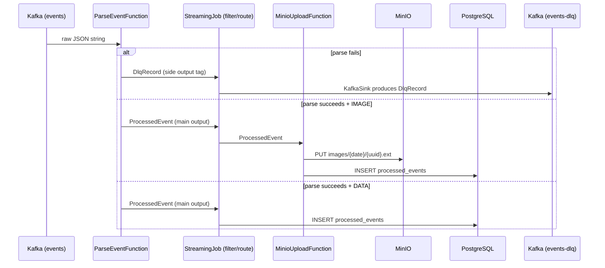

# Flink Pipeline Flow

```mermaid
sequenceDiagram
    participant K as Kafka (events)
    participant PEF as ParseEventFunction
    participant SJ as StreamingJob (filter/route)
    participant MU as MinioUploadFunction
    participant MINIO as MinIO
    participant PG as PostgreSQL
    participant KDLQ as Kafka (events-dlq)

    K->>PEF: raw JSON string

    alt parse fails
        PEF->>SJ: DlqRecord (side output tag)
        SJ->>KDLQ: KafkaSink produces DlqRecord
    else parse succeeds + IMAGE
        PEF->>SJ: ProcessedEvent (main output)
        SJ->>MU: ProcessedEvent
        MU->>MINIO: PUT images/{date}/{uuid}.ext
        MU->>PG: INSERT processed_events
    else parse succeeds + DATA
        PEF->>SJ: ProcessedEvent (main output)
        SJ->>PG: INSERT processed_events
    end
```
